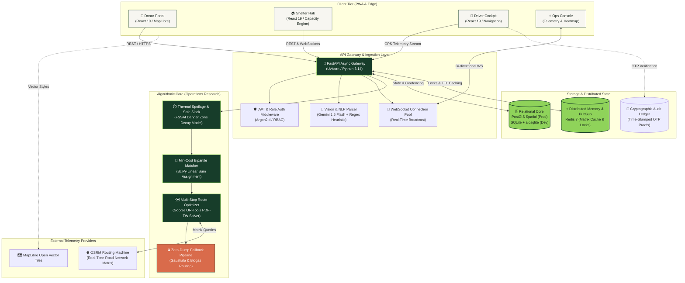
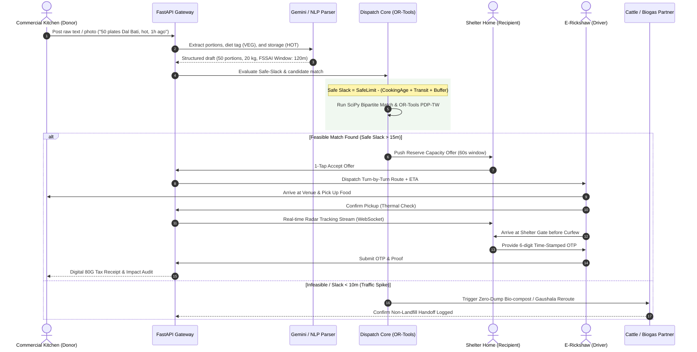
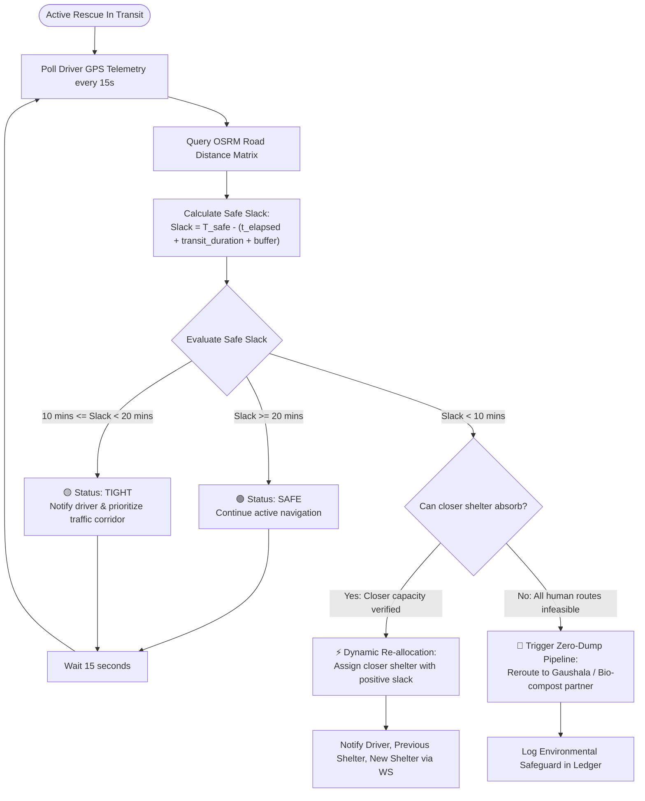

# ⏳ GoldenHour — Algorithmic Food Rescue Logistics Engine

[](https://opensource.org/licenses/MIT)
[](https://python.org)
[](https://fastapi.tiangolo.com)
[](https://react.dev)
[](https://www.typescriptlang.org)
[](https://developers.google.com/optimization)
[](https://fssai.gov.in)

> **GoldenHour** is a real-time, deadline-driven logistics engine that intercepts commercial food surplus (banquets, hotels, caterers, and messes) and matches it to recipient shelters *before bacterial spoilage thresholds are crossed*. Unlike conventional directories that optimize for static proximity, GoldenHour formulates food rescue as a **time-constrained deadline scheduling problem** combining thermal decay physics, bipartite matching, and vehicle routing with time windows.

---

## 🏛️ System Architecture

GoldenHour is structured as an event-driven, asynchronous micro-monolith designed for sub-second algorithmic dispatch and real-time WebSocket state synchronization.



---

## 🔄 End-to-End Sequence: Life of a Rescue

This sequence diagram illustrates the lifecycle of a surplus food donation from initial logging to verified delivery.



---

## ⏱️ Real-Time Dynamic Safe-Slack Re-Routing Loop

GoldenHour's safety monitor continuously evaluates active routes against live traffic conditions.



---

## 🛠️ Technology Stack

| Layer | Technologies | Purpose |
| :--- | :--- | :--- |
| **Frontend UI/UX** | **React 19**, TypeScript, MapLibre GL, Zustand | Mobile-first Progressive Web App (PWA) with sub-second vector map rendering. |
| **Backend Framework** | **FastAPI**, Python 3.14, AsyncIO, Uvicorn | Asynchronous, non-blocking REST API and WebSocket gateway. |
| **Optimization Core** | **Google OR-Tools (v9.10+)**, **SciPy** | Solves Bipartite matching and Pickup and Delivery with Time Windows (PDP-TW). |
| **AI / NLP Ingestion** | **Google Gemini 1.5 Flash**, Regex Heuristics | Zero-friction natural language donation extraction with offline fallback. |
| **Spatial & Persistence** | **PostGIS (PostgreSQL 16)**, **SQLite + aiosqlite** | Production spatial indexing (`ST_DWithin`, `ST_Point`) with zero-config local dev fallback. |
| **State & Cache** | **Redis 7 (Alpine)** | Distributed route matrix caching, pub/sub messaging, and atomic rate-limiting. |
| **Food Safety Science** | **FSSAI 2019 Regulatory Engine** | Enforces exponential bacterial decay curves and maximum danger zone thresholds. |

---

## 🚀 Quick Start (Local Development)

### Prerequisites
* **Node.js** (v18+)
* **Python** (v3.12+)

### One-Click Startup (Recommended)
From the repository root or the `goldenhour-app` folder:
```cmd
.\start.bat
```
*This automatically sets up Python `.venv`, installs dependencies, initializes the zero-config SQLite database, builds frontend modules, and starts both servers.*

### Manual Startup

#### 1. Backend Server (FastAPI)
```powershell
cd d:\AMI-HACK
python -m venv .venv
.\.venv\Scripts\activate
pip install -e .
python -m uvicorn app.main:app --host 0.0.0.0 --port 8000 --reload
```
* Backend API: `http://localhost:8000`
* Interactive OpenAPI (Swagger) Docs: `http://localhost:8000/docs`
* Health Probes: `http://localhost:8000/healthz` and `http://localhost:8000/readyz`

#### 2. Frontend Client (Vite + React)
```powershell
cd d:\AMI-HACK\goldenhour-app
npm install
npm run dev
```
* Live Application: `http://localhost:5173`

---

## 🗺️ Verified Jaipur Rescue Corridor

The platform is seeded and validated with real-world geospatial coordinates across Jaipur's primary hospitality and institutional shelter clusters:

* **Primary Donor Hubs:** Mansarovar Banquet Cluster, C-Scheme Kitchens, Tonk Road Event Lawns, Vaishali Nagar Cloud Kitchens.
* **Shelter Partner Nodes:** Asha Shelter Home (Malviya Nagar), Bal Sambhal Kendra (JLN Marg), Jagatpura Community Kitchen.
* **Micro-Transit Fleet:** Multi-modal driver profiles including E-Rickshaws (100-portion capacity), Two-Wheelers (30-portion thermal backpacks), and Light Commercial Vans.

---

## 📄 License & Attribution
GoldenHour is an open-source initiative developed for **Ami-Hack 2026** under the **Track A: Surplus-to-Shelter** problem statement. Licensed under the [MIT License](LICENSE).
